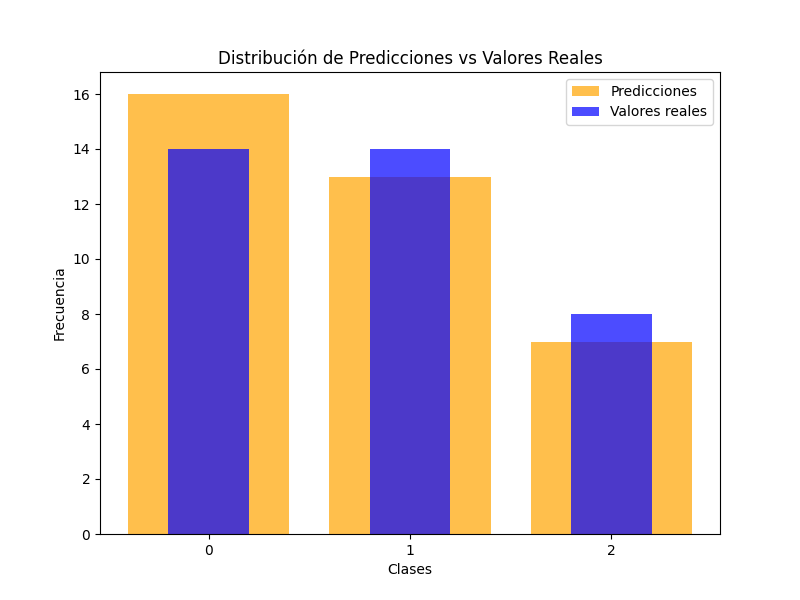

# Exactitud del Modelo Probabilístico (KDE)

El modelo probabilístico basado en Kernel Density Estimation (KDE) alcanzó una **exactitud** de:

## 🎯 **0.7777** 🎯

### Descripción
- **Método utilizado:** KDE (Kernel Density Estimation)
- **Métrica evaluada:** Exactitud
- **Dataset:** [Nombre del dataset]

### Visualización de la Distribución (KDE)

---

*Desarrollado por: [Tu nombre o equipo]* 
